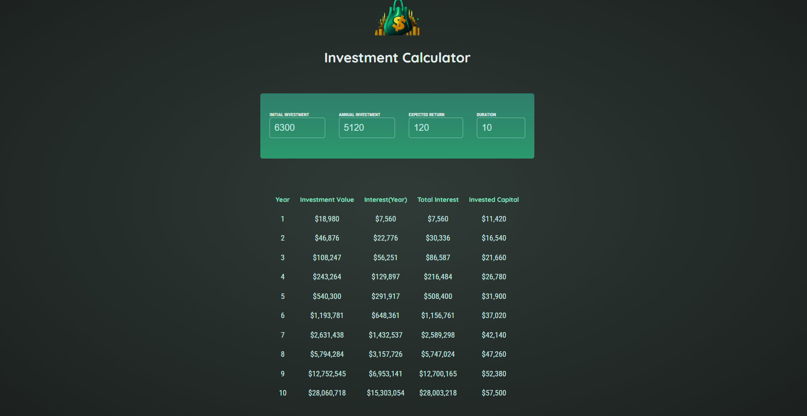

# Investment Calculator

Plan your investment route with this app!

## Game UI



## How to run the project locally

### 0. Prerequisities:

- If you don't have `Node.js` on your PC, install it [here](https://nodejs.org/en/download) (use version **20.18.0** or above)

- Verify `node` version

```bash
node -v // Should print "v20.18.0" or above.
```

- Verify `npm` version

```bash
npm -v // Should print "10.9.0" or above.
```

### 1. Clone the repository:

```bash
git clone https://github.com/PikuzaMarie/investment-calculator.git
```

### 2. Go to the directory:

```bash
cd investment-calculator
```

### 3. Install dependencies:

```bash
npm install
```

### 4. Start the project

It will automatically run in your default browser at http://localhost:3000/

```bash
npm run dev
```

## Features

- [x] Implement features adhering to technical task to [task](/docs/taskDescription/task.md)
- [x] Derive neccessary data from single state `userInputData`
- [x] Calculate investment result with [utility function](src/common/utils/calculateInvestmentResults/calculateInvestmentResults.js)
- [x] Display [ResultTable](src/components/ResultTable/ResultTable.jsx) if `duration` value is valid or [InfoMessage](src/components/InfoMessage/InfoMessage.jsx) otherwise
- [x] Customize settings via [inputsConfig](src/common/constants/inputsConfig/inputs-config.js) and [resultTableConfig](src/common/constants/resultTableConfig/result-table-config.js)

## Extra

- [x] Clean code with the use of `ESLint`, `Prettier` & `lint-staged`
- [x] Deploy on Netlify to [calculate your investment](https://investment-calculator-by-marie.netlify.app/)

## Contribution

This project was developed using materials from the`'React - The Complete Guide 2025'` instructed by `Maximilian Schwarzmüller` at `Academind`: [link to github repo](https://github.com/academind/react-complete-guide-course-resources/blob/main/attachments/05%20Essentials%20Practice)
